# Lab 00 — Discover AWS Locally with LocalStack

> **Series:** Le Café ☕ — AWS Hands-On Labs with LocalStack  
> **Level:** Beginner | **Duration:** ~60 min | **Prerequisites:** Docker, Python 3.8+, AWS CLI

---

## Learning Objectives
By the end of this lab, you will be able to:
* Explain what LocalStack is and why it exists.
* Install and start LocalStack on your local machine.
* Configure the AWS CLI to communicate with LocalStack instead of real AWS.
* Interact with three core AWS services (**S3, IAM, SQS**) entirely offline.
* Understand how LocalStack fits into a professional DevOps/DevSecOps workflow.

---

## Part 1 — Installation

### Step 1 — Verify Docker Setup
LocalStack runs as a Docker container, so Docker must be installed and running first. Verify Docker is running with:
```bash
docker --version
docker ps
```
*If `docker ps` returns an error, start Docker Desktop (macOS/Windows) or run `sudo systemctl start docker` (Linux) before continuing.*

---

### Step 2 — Install the LocalStack CLI
The LocalStack CLI is a Python wrapper that makes starting and managing the container easier than writing complex `docker run` commands by hand.

```bash
# Install the CLI globally via pip
pip install localstack

# Confirm the installation
localstack --version
```

#### Verification Screenshot:
*Installing `localstack`:*
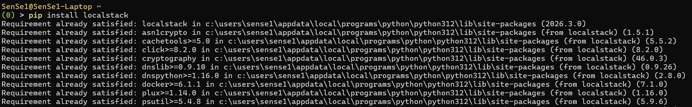

*Verifying installation version:*
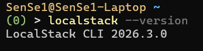

---

### Step 3 — Install `awslocal` (AWS CLI Wrapper)
`awslocal` is a thin wrapper around the standard `aws` CLI. It automatically adds `--endpoint-url http://localhost:4566` to every command, saving you from typing it every time.

```bash
# Install the awslocal wrapper
pip install awscli-local

# Verify the installation
awslocal --version
```

> [!NOTE]
> **`awslocal` vs `aws`:** Both tools work. `awslocal` is just a convenience alias. As you advance, you will use the standard `aws` CLI with `--endpoint-url` in scripts, which is closer to production configurations.

#### Verification Screenshot:
*Installing `awscli-local`:*
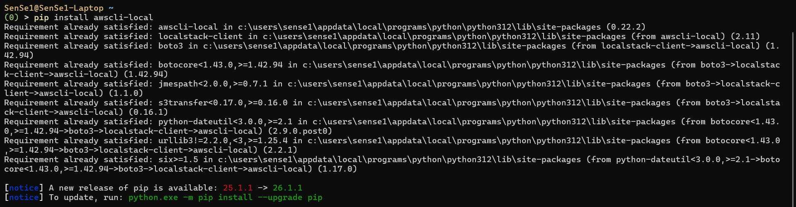

*Verifying `awslocal` version:*
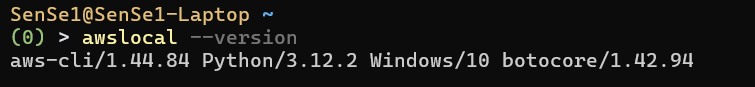

---

## Part 2 — Start LocalStack

### Step 4 — Launch the LocalStack Container
We run the container in **detached mode** (`-d`) to free up the terminal. LocalStack will pull the Docker image on first run (this may take a moment).

```bash
localstack start -d
```

#### Verification Screenshot:
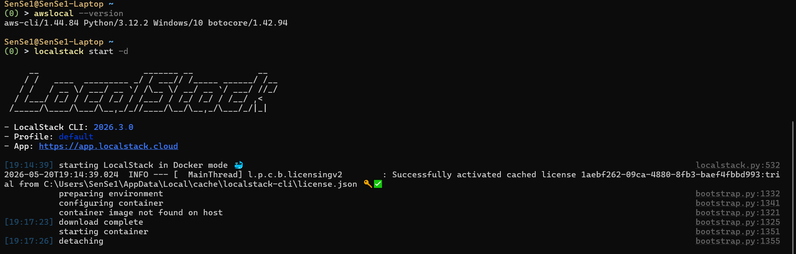

---

### Step 5 — Verify Running Container & Services
Verify that the services are active and the container is healthy:

```bash
# Watch the container start up
localstack status services
```
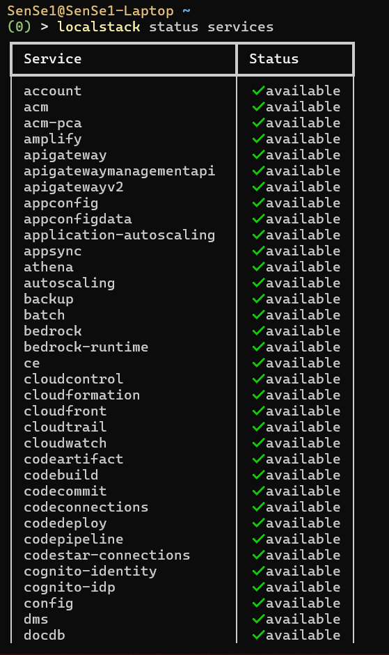

```bash
# Check the running Docker container
docker ps --filter name=localstack
```
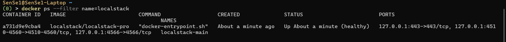

```bash
# Inspect LocalStack health endpoint (PowerShell)
Invoke-RestMethod http://localhost:4566/_localstack/health | ConvertTo-Json -Depth 10

# Inspect LocalStack health endpoint (bash / macOS / Linux)
curl http://localhost:4566/_localstack/health | python3 -m json.tool
```
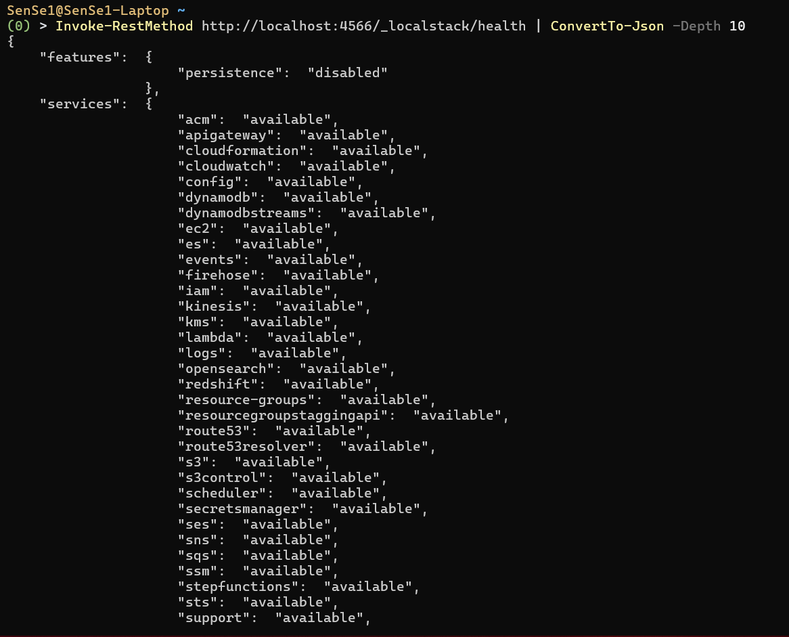

---

## Part 3 — Configure the AWS CLI

### Step 6 — Create a Fake AWS Profile
LocalStack does not validate credentials, but the AWS CLI requires them to exist. We create a dedicated profile so we never accidentally mix up LocalStack and real AWS.

```bash
aws configure --profile localstack
```
Provide the following values at the prompts:
* **AWS Access Key ID:** `test`
* **AWS Secret Access Key:** `test`
* **Default region name:** `us-east-1`
* **Default output format:** `json`

> [!IMPORTANT]
> Using `test` as credentials is a community convention signaling that this profile is local/fake, preventing accidental commits or exposures.

#### Verification Screenshot:
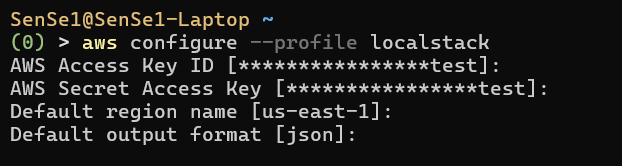

---

### Step 7 — Set Profile as Default for This Session
Set the default profile for your current terminal session so that `aws` and `awslocal` commands read the correct settings.

**For Windows (CMD / PowerShell):**
```powershell
set AWS_PROFILE=localstack
# Or in PowerShell:
$env:AWS_PROFILE="localstack"
```

**For macOS / Linux:**
```bash
export AWS_PROFILE=localstack
```

#### Verification Screenshot:
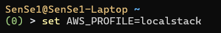

---

## Part 4 — Your First LocalStack Resources

Now that LocalStack is running and your CLI is configured, let's create and interact with local AWS resources.

### Step 8 — Create an S3 Bucket & Manage Objects
Le Café wants to store its digital menus in S3. Let's create the bucket, upload a menu file, verify, and verify downloading it.

```bash
# 1. Create the bucket
awslocal s3 mb s3://lecafe-menus
```
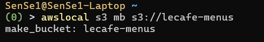

```bash
# 2. Verify bucket exists
awslocal s3 ls
```
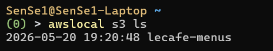

```bash
# 3. Create a sample menu file and upload it
echo "Espresso: 2.50 | Latte: 3.50 | Croissant: 2.00" > menu.txt
awslocal s3 cp menu.txt s3://lecafe-menus/menu-paris.txt
```
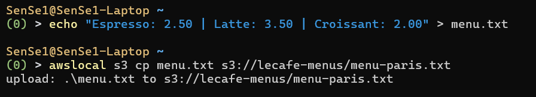

```bash
# 4. Confirm the upload
awslocal s3 ls s3://lecafe-menus/
```
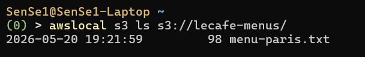

```bash
# 5. Download the file to verify round-trip
awslocal s3 cp s3://lecafe-menus/menu-paris.txt menu-downloaded.txt
```
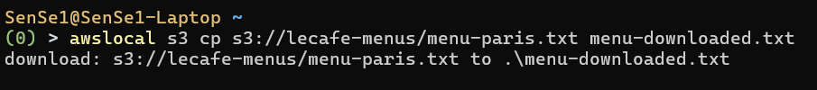

```bash
# 6. View downloaded content
cat menu-downloaded.txt
```
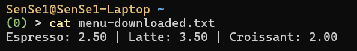

---

### Step 9 — Create an IAM User & Policies
In AWS, applications should never run with root credentials. We will simulate creating a dedicated IAM user for the Le Café backend app and attach read-only access to S3.

```bash
# 1. Create the IAM user
awslocal iam create-user --user-name lecafe-app
```
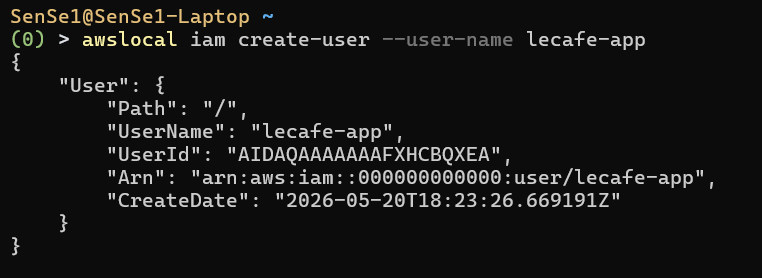

```bash
# 2. List users to confirm
awslocal iam list-users
```
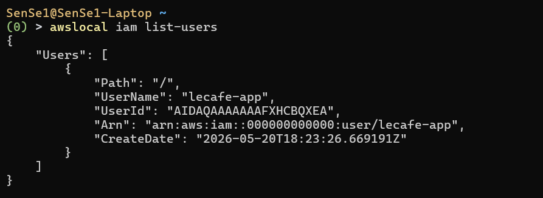

```bash
# 3. Attach a Policy (Allow this user read-only access to S3)
awslocal iam attach-user-policy --user-name lecafe-app --policy-arn arn:aws:iam::aws:policy/AmazonS3ReadOnlyAccess
```
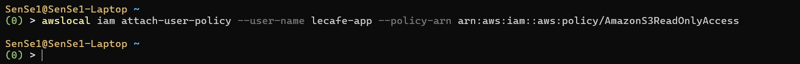

```bash
# 4. Verify attached policies
awslocal iam list-attached-user-policies --user-name lecafe-app
```
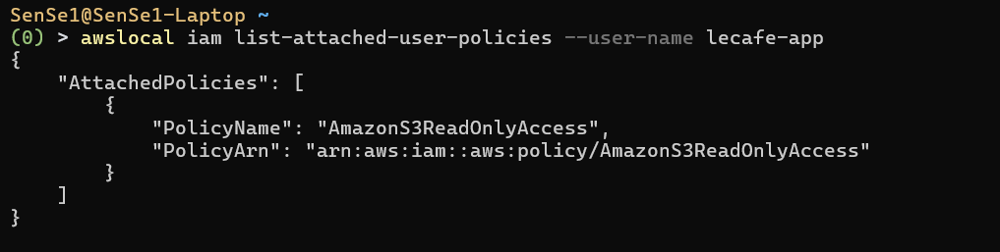

---

### Step 10 — Create an SQS Queue & Send/Receive Messages
Le Café wants to process orders asynchronously. SQS (Simple Queue Service) is the AWS-native way to decouple order placement from the kitchen console.

```bash
# 1. Create a standard queue
awslocal sqs create-queue --queue-name lecafe-orders
```
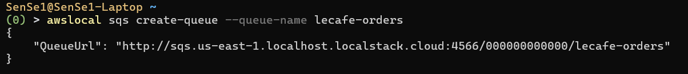

```bash
# 2. Get the queue URL
awslocal sqs get-queue-url --queue-name lecafe-orders
```
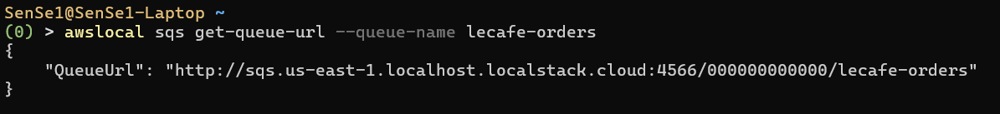

```bash
# 3. Send a test order message
# Note: For Windows CMD/PowerShell, ensure quotes are escaped correctly
awslocal sqs send-message --queue-url http://localhost:4566/000000000000/lecafe-orders --message-body "{\"item\":\"Latte\",\"size\":\"large\",\"table\":7}"
```
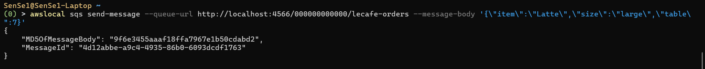

```bash
# 4. Read the message back (simulating the kitchen consumer)
awslocal sqs receive-message --queue-url http://localhost:4566/000000000000/lecafe-orders
```
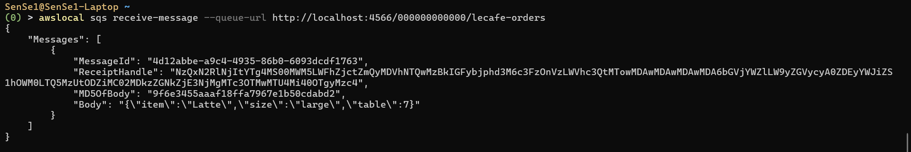

> [!NOTE]
> The received message includes a `ReceiptHandle`, which the consumer system uses to delete the message after successful processing, preventing other consumers from picking it up.

---

## Part 5 — Inspect LocalStack Internals

### Step 11 — Explore the Swagger Web UI Dashboard
LocalStack Community Edition exposes a Swagger documentation interface, allowing you to inspect the available endpoints, structures, and APIs.

Open in your browser: [http://localhost:4566/_localstack/swagger](http://localhost:4566/_localstack/swagger)

#### Dashboard Screenshot:
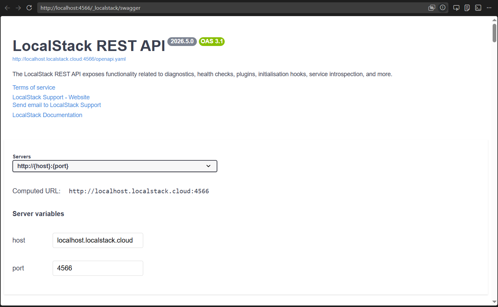

---

### Step 12 — Check LocalStack logs
Check logs in real-time to debug request payloads, latency, HTTP methods, and status codes.

```bash
localstack logs
```

#### Logs View Screenshot:
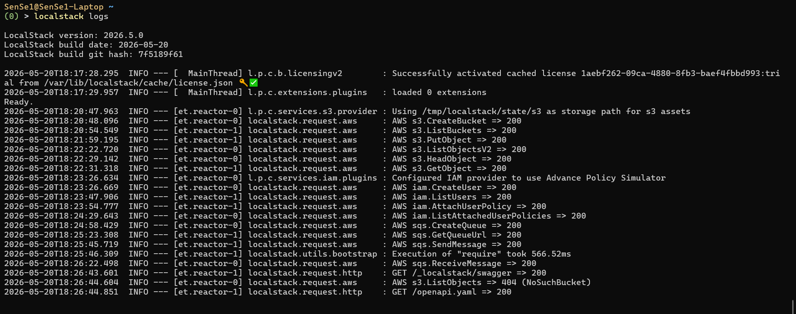

---

## Part 6 — Cleanup

When you are done, stop LocalStack to free up system resources. Because LocalStack is stateless/in-memory by default, all resources you created will be deleted when the container stops.

```bash
# Stop the LocalStack container
localstack stop
```
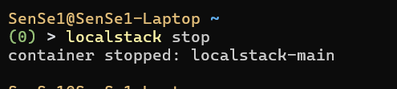

---